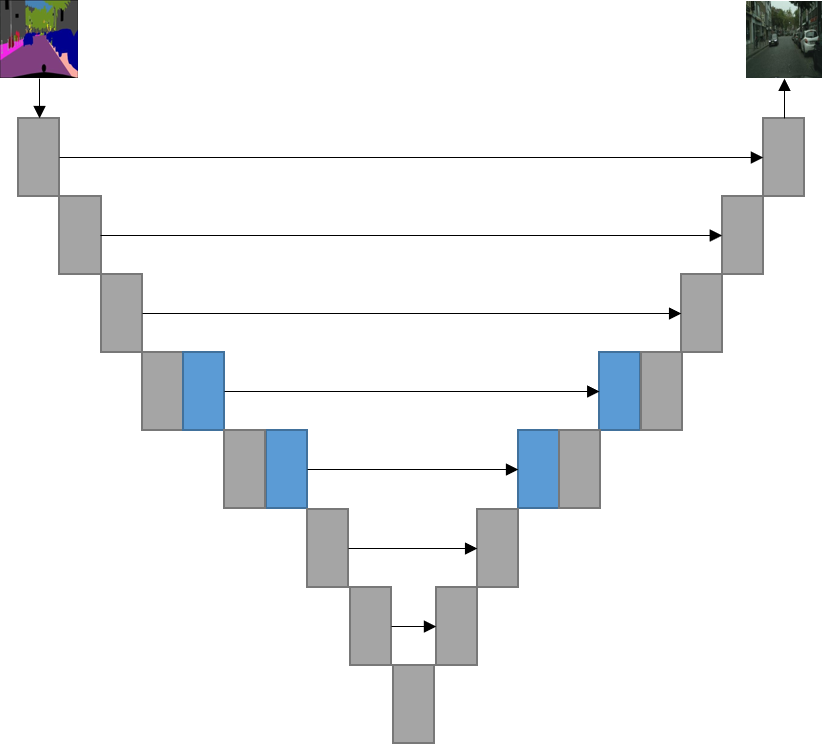

# Pix2Pix Conditional Generative Adversarial Network
Author: Allen Lynch, 2019

## Goal
<hr>
Demonstrate my ability to translate important entries in the ML literature into my own easy-to-use platform. Here, I use TensorFlow to implement recent innovations in conditional GAN networks, utilizing a suite of the framework's capabilities:
* Keras Functional and Sequential APIs
* TensorFlow Datasets
* TensorBoad Integration
* Model Checkpointing
* Custom Loss Functions
* Custom Training Behavior

I packaged the model-training script into a convenient program with hyperparameters exposed as argmuments for tuning the training.

## Architectures
<hr>
Generative network (G): 8-layer U-Net with strided downsampling instead of pooling and nearest-neighbor+convolutional upsampling. Grey boxes show convolutional layers, while blue shows self-attention layers. Instance normalization is used instead of batch-normalization before ReLU non-linearities are applied<br>


Critic network (D): 5-layer PatchGAN with score averaging. Each patch observes 70x70 pixel square of input image. This could be tailored for different input image sizes in the future.<br>


## Features for stable training
<hr>
* Least-squares loss
* Label smoothing
* Variable generator training steps per critic training step
* Critic trains on recent history of generated images, not just last batch
* Different learning rates for critic and generator
* Just-in-time data augmentation in training pipeline
* Spectral normalization of weights of generator and critic
* Generator weight averaging with Beta of 0.999

## Dataset
<hr>
<a href="https://www.cityscapes-dataset.com/">Cityscapes Dataset</a><br>

<p>Goal: Predict real image from segmented image.</p>

## Results
<hr>
After the first stable training routine, these images were generated from the test set. Though not perfect, one can see the generator is learning the rules of lanes on streets and is modeling impressive diversity in the look of vehicles. Clearly, more training time was needed but I needed my computer for something else so this setup was cut short.<br>
<br>

Since my GAN produced these examples, I have made many modifications to my GAN generator architecture, training algorithms, training stabilization, and hyperparameter choices. I may add more examples once I finalize my architecture choices and commit to a long training session.

## Usage
<hr>
Use *train_pixelGAN.py* to train a pix2pix adverserial network on a training and validation directory:

```text
usage: train_pixelGAN.py [-h] [-s STEPS_PER_EPOCH] [-lr LEARNING_RATE]      
                         [--input_shape INPUT_SHAPE INPUT_SHAPE INPUT_SHAPE]
                         [--batch_size BATCH_SIZE]
                         [--generator_steps GENERATOR_STEPS]
                         [--critic_steps CRITIC_STEPS]
                         [--checkpoint_every CHECKPOINT_EVERY]
                         [--load_from_checkpoint] [--MAE_lambda MAE_LAMBDA] 
                         [--label_smoothing] [--logdir LOGDIR]
                         [--buffer_size BUFFER_SIZE]
                         [--critic_lr_factor CRITIC_LR_FACTOR]
                         [--spectral_norm] [--generator_ema]
                         train_dir validation_dir checkpoint_dir epochs

positional arguments:
  train_dir             Path to training data directory
  validation_dir        Path to testing data directory
  checkpoint_dir        Directory for depositing training checkpoints
  epochs                Number of epochs to train for.

optional arguments:
  -h, --help            show this help message and exit
  -s STEPS_PER_EPOCH, --steps_per_epoch STEPS_PER_EPOCH
                        Number of iterations to run in each epoch.
  -lr LEARNING_RATE, --learning_rate LEARNING_RATE
                        Generator learning rate
  --input_shape INPUT_SHAPE INPUT_SHAPE INPUT_SHAPE
                        size of input images
  --batch_size BATCH_SIZE
                        Batch size, recommended: 1
  --generator_steps GENERATOR_STEPS
                        Number of generator steps per training step,
                        recommended: 1-2
  --critic_steps CRITIC_STEPS
                        Number of critic steps per training step, recommended:
                        1-2
  --checkpoint_every CHECKPOINT_EVERY
                        Number of epochs between every checkpoint
  --load_from_checkpoint
                        Load models from most recent checkpoint in checkpoint
                        directory.
  --MAE_lambda MAE_LAMBDA
                        Lambda for L1-norm loss
  --label_smoothing
  --logdir LOGDIR       Directory to deposit loss data
  --buffer_size BUFFER_SIZE
                        Buffer size for critic
  --critic_lr_factor CRITIC_LR_FACTOR
                        Multiplier for critic learning rate relative to
                        generator's
  --spectral_norm       Apply spectral normalization to weights of generator
                        and discriminator
  --generator_ema       Apply EMA to generator weights to stabilize training.
  ```

## References
<hr>
<ol>
<li>Isola, et al., 2016, <a href="https://arxiv.org/abs/1611.07004">Image-to-Image Translation with Conditional Adversarial Networks</a>
<li>Arjovsky, et al., 2017, <a href="https://arxiv.org/abs/1701.07875">Wasserstein GAN</a>
<li>Gulrajani, et al., 2017, <a href="https://jwcn-eurasipjournals.springeropen.com/articles/10.1186/s13638-018-1196-0">Improved Wasserstein conditional generative adversarial network speech enhancement<a/>
<li>Shrivastava, et al., 2017, <a href="https://arxiv.org/pdf/1612.07828.pdf">Learning from Simulated and Unsupervised Images through Adversarial Training</a>
<li>Heusel, et al., 2018, <a href="https://arxiv.org/pdf/1706.08500.pdf">GANs Trained by a Two Time-Scale Update Rule
Converge to a Local Nash Equilibrium</a>
<li>Odena, et al., 2016, <a href="https://distill.pub/2016/deconv-checkerboard/">Deconvolution and Checkerboard Artifacts</a>
<li>Zhu, et al., 2017, <a href="https://arxiv.org/abs/1703.10593">Unpaired Image-to-Image Translation using Cycle-Consistent Adversarial Networks</a>
<li>Salimans, et al. 2016, <a href="http://papers.nips.cc/paper/6125-improved-techniques-for-training-gans.pdf">Improved Techniques for Training GANs</a>
<li>Miyato, et al. 2018, <a href="https://arxiv.org/abs/1802.05957">Spectral Normalization for Generative Adversarial Networks</a>
<li>Brock, et al. 2019, <a href="https://arxiv.org/abs/1809.11096">Large Scale GAN Training for High Fidelity Natural Image Synthesis</a>
<li>Zhang, et al. 2018, <a href="https://arxiv.org/abs/1805.08318">Self-Attention Generative Adversarial Networks</a>
</ol>